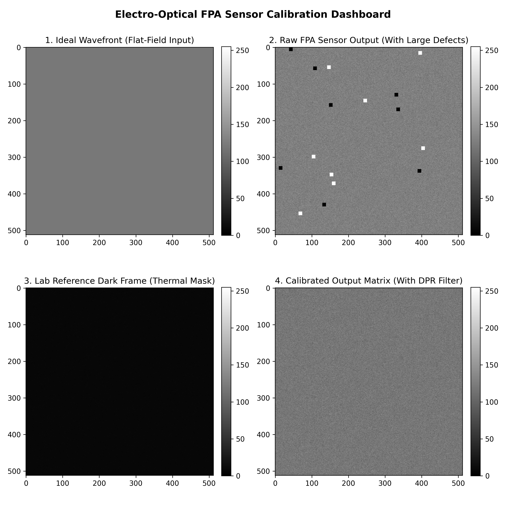

# Electro-Optical Focal Plane Array (FPA) Sensor Calibration & Ingest Simulator

## Technical Project Overview
Provided here is a simple Python script designed to simulate non-ideal hardware limitations of FPAs and apply radiometric calibration metrics to guarantee data correction and integrity. 

## Modeled Sensor Physics & Defect Mechanics

1. **Dark Current Offset:** Simulates thermal baseline electron drift generated within the silicon matrix, modeled via a uniform matrix bias.
2. **Fixed-Pattern Noise (FPN):** Column-to-column pixel sensitivity variations caused by microscopic manufacturing tolerances, modeled via a Gaussian distribution layer.
3. **Photon Shot Noise:** Time-varying noise caused by the statistical randomness of photon arrival rates, modeled dynamically based on local amplitude values.
4. **Silicon Array Defects:** Randomly distributes large manufacturing errors/discrepancies including **Dead Pixels** (pixels with 0 counts) and shorted **Hot Pixels** (pixels saturated at 255 counts).

## Calibration Architecture

* **Radiometric Flat-Field Correction:** Ingests a laboratory reference "Dark Frame" (lens cap closed simulation) to subtract uniform thermal drift bias, and applies a gain matrix normalization map to iron out pixel-to-pixel responsivity variances.
* **Dynamic Dead Pixel Replacement (DPR) Filter:** Programmatically generates a **Bad Pixel Map (BPM)** from raw uncalibrated limits, scans out-of-bound coordinate matrices, and applies a dynamic neighborhood expansion loop (3x3 up to 15x15) to calculate localized median interpolation values, filtering out complex multi-pixel cluster defects.
